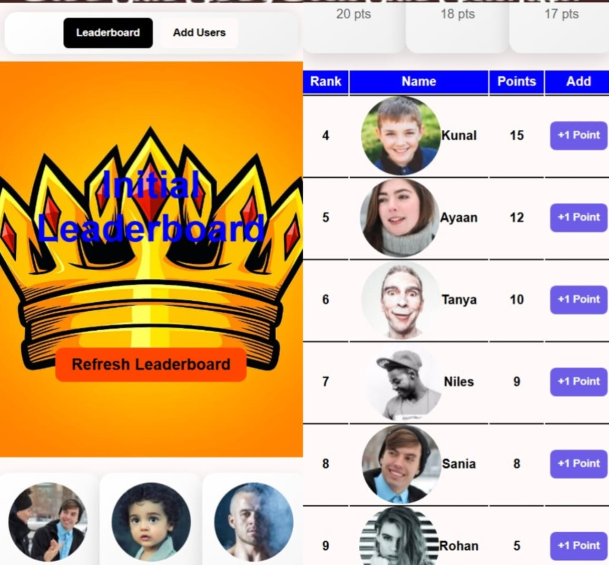

<h1 align="center" style="color:#2c3e50;">🏆 Leaderboard System</h1>

<p align="center">
  
</p>

<p align="center">
  <b>A dynamic, full-stack Leaderboard app to claim random points, track history, and rank users in real-time.</b><br>
  Built with ReactJS & Node.js (Express), powered by MongoDB.
</p>

---

## 📄 About the Project

The **Leaderboard System** allows users to:
- Select or add a user
- Claim random points (1–10)
- Store claim history in MongoDB
- View dynamic rankings and total points

It features a clean, responsive UI and real-time leaderboard updates upon every claim.

---

## 🌟 Features

- 👥 **User Management**
  - Select from predefined users or add new users via UI.

- 🎲 **Random Points Claim**
  - Points (1 to 10) awarded via "Claim" button.

- 🧠 **Dynamic Leaderboard**
  - Users are ranked in real-time by total points.

- 🧩 **Modular Code Structure**
  - Clean separation of frontend (React) and backend (Express).

---

## 🛠️ Tech Stack

- ⚛️ **Frontend:** ReactJS (Vite), TailwindCSS
- 🧠 **Backend:** Node.js, Express.js
- 🗃️ **Database:** MongoDB (Mongoose ODM)
- 🌐 **Hosting:** Vercel (Frontend) & Render (Backend)

---

## 🚀 Live Demo

- 🔗 **Frontend (Vercel):** https://leaderboard-frontend-eta-five.vercel.app/
- 🔗 **Backend (Render):** https://leaderboard-backend-ytsu.onrender.com

---

## 📁 Project Structure

```bash
leaderboard-project/
├── frontend/                  # React frontend
│   ├── src/
│   │   ├── components/
│   │   ├── services/
│   │   ├── App.jsx
│   │   └── main.jsx
│   ├── public/
│   ├── index.html
│   └── package.json
│
├── backend/                  # Express backend
│   ├── models/              # User & ClaimHistory schemas
│   ├── controllers/
│   ├── routes/
│   ├── server.js
│   └── package.json
│
├── .gitignore
├── README.md
└── env.example              # Add your MongoDB URI & environment vars
```
⚙️ Getting Started
🛠 Backend Setup
1️⃣ Navigate to backend folder

```
cd server
```
2️⃣ Install dependencies

```
npm install
```
3️⃣ Create .env file with:

```
MONGODB_URI=your_mongodb_uri
```

4️⃣ Run server

```
node server.js
```

### 🎨 Frontend Setup
1️⃣ Navigate to client folder

```
cd frontend
```
2️⃣ Install dependencies

```
npm install
```
4️⃣ Run frontend

```
npm run dev
```
Visit: http://localhost:5173

🧪 API Endpoints Overview
GET /api/users – Add a new user

GET /api/claim – Claim points

GET /api/leaderboard – Get leaderboard

👤 Contributor
<table> <tr> <td align="center">  <br /><sub><b>Danish Rizwan</b></sub><br /> <sub>Full Stack Developer</sub> </td> </tr> </table>
📬 Contact
📧 Email: rdanishrizwan@example.com

💼 Team: Open Source | Internship Task


---


Ask ChatGPT

